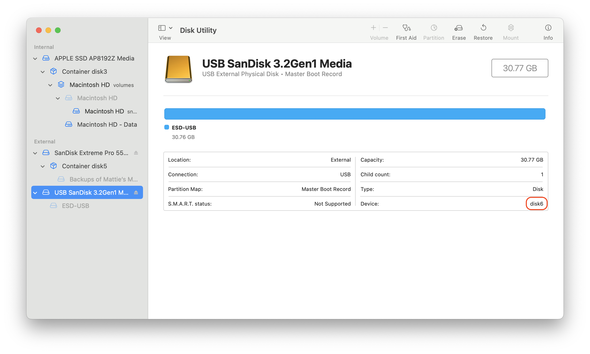

# windows-iso-to-usb

A macOS tool to convert a Windows 11 ISO image to a bootable USB drive.

## Requirements

- The command-line tools from [wimlib](https://wimlib.net) (available in [Homebrew](https://brew.sh))

All remaining requirements are already included in macOS. Patches are welcome for portability.

## Usage

```
windows-iso-to-usb ISO_FILE DISK
```

Writes the content the ISO image in ISO_FILE to the USB disk at DISK.

DISK must be the device name (e.g. "/dev/disk6" or just "disk6"). You can find it with the "diskutil" command:

```
diskutil list
```

Or with Disk Utility, with "View" → "Show All Devices" set:



windows-iso-to-usb will show you information about the disk before erasing it, to confirm it is the disk you want to use.

## How it works

[windows-iso-to-usb](./windows-iso-to-usb) tries to mimic the output of the [Windows Media Creation Tool](https://www.microsoft.com/en-us/windows/learning-center/windows-media-creation-tool) as closely as possible. Specifically, it uses an MBR partition table and a single FAT32 volume which it names "ESD-USB".

FAT32 has a limitation of 4 GB files, so one extra step is needed: splitting a large install.wim file into files that will fit. Here, we mimic the steps taken [in Microsoft's Flash Drive installer documentation](https://learn.microsoft.com/en-us/windows-hardware/manufacture/desktop/install-windows-from-a-usb-flash-drive?view=windows-11#if-your-windows-image-is-larger-than-4gb) and split the image into chunks of 3800 MB.

Some ISO images (such as the ones created by [windows-esd-to-iso](https://github.com/mattieb/windows-esd-to-iso)) don't have install.wim, but have install.esd instead. If this is present, it convert it to an install.wim file before splitting.

## Caveats

While this tool will likely operate on ARM ISOs, I have not tested the produced USB images.

## Licensing

While this tool itself is [already licensed to you](./LICENSE.md), Windows itself may require licensing and activation.

You must address this; this tool does not.
